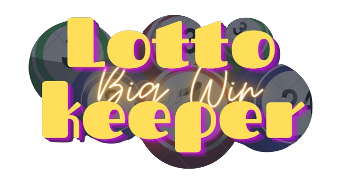

# LOTTO KEEPERE

**https://lotto-keeper.azurewebsites.net/#/UserPage**

## Tech Stack

- React
- Typescript
- SASS, SCSS
- Reactstrap, Bootstrap 5
- Jest

## irányelvek

- Functional programming
- Context API
- testing
- LocalStorage save
- Mobile first design
- Reszponzív design
  A táblázat miatt a reszponzív design 500px alá nem megy.
- clean coding

### React

A projektben használt React technologiák:

- npx create-react-app
- React hooks
- Context API
- React Router V6
  Hashrouterel ha GitHub hosztolásra kerülne sor akkor is működjön.
- Components (functional)
- Typescript TSX
- createContext, useContext, useState, useEffect, ReactNode
- onClick, onBlur
- style module

### Typescript

A projektben használt Typescript technologiák:

- Tipusok: Egyszerű adattípusok, Összetett adattípusok, Set
- type, interface
- localStorage
- függvények, map, filter, reduce, sort, find, sort, Array.from, Array.fill replace, toString, Number, String, Math.round, Math.floor, Math.random, Math.abs, localeCompare
- Spread operátor, destrukturálás
- elágazások if, switch, ternary operator
- shallow copy, deep copy

### Jest

- test.each
- toBe
- toBeGreaterThanOrEqual
- toBeLessThanOrEqual
- expect

### Kérdések

- Nyeremény elosztás?

  Mivel a nyeremény elosztásában szabad kezet kaptam kevés feltétellel, egy ábrával szeretném prezentálni hogy kiként osztottam szét a nyereményt a feltételeknek megfelelve.

- A nevét és az egyenlegét ne veszítse el, ha napok múlva újra visszatér játszani?

  Én a frontend feleadat végett meg az egyszerűség kedvéért a LocalStorage mellet döntöttem. De ha szeretnék csinálhatok hozzá egy NodeJS, ExpressJS Backendet adatbázissal.

##### felhasznált elemek:

- https://react-icons.github.io/react-icons
  icon font awesome
- https://react-bootstrap.netlify.app/
  Modals
- https://getbootstrap.com/
  Modals Style
- https://www.canva.com/
  img
- https://jestjs.io/docs/getting-started
  test
